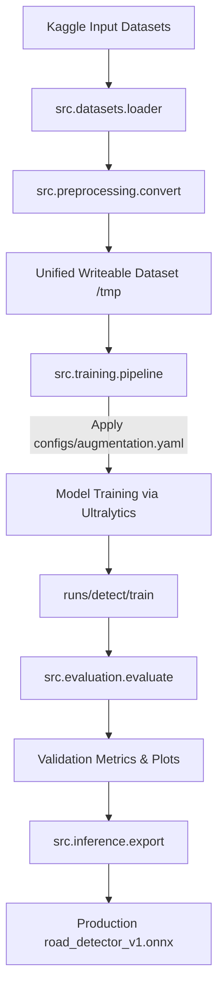

# ML Training & Inference Pipeline

This document details the architecture, stages, and data flows of the `civiclens` machine learning model.

---

## 1. Pipeline Overview

The pipeline starts with raw Kaggle input datasets and yields a production-ready ONNX model with a complete model card.

---

## 2. Pipeline Stages

### Stage 1: Data Loading & Unification
Implemented in [`src/datasets/loader.py`](file:///home/harsh/Desktop/CodeNova/civiclens/ml-engine/src/datasets/loader.py) and [`src/preprocessing/convert.py`](file:///home/harsh/Desktop/CodeNova/civiclens/ml-engine/src/preprocessing/convert.py).
1. **Source scan**: Read `configs/dataset.yaml` to detect which datasets are enabled and locate their roots (e.g., `/kaggle/input/...`).
2. **Convert to YOLO format**:
   - COCO JSON and Hugging Face dataset outputs are converted to standard YOLO text format (`class_id x_center y_center width height` normalized).
   - Class indices are mapped to the unified 7-class taxonomy.
3. **Symbolic Linking**: Since Kaggle datasets are read-only, image files are symlinked to `/tmp/unified_dataset/images/` (split into `train`/`val`) to save time and storage, while custom label text files are written to `/tmp/unified_dataset/labels/`.

### Stage 2: Augmentation & Input Pipeline
Implemented in [`src/augmentation/`](file:///home/harsh/Desktop/CodeNova/civiclens/ml-engine/src/augmentation/) and customized via `configs/augmentation.yaml`.
- Core spatial transforms: Random rotation, scaling, shifting, shearing, and horizontal/vertical flips.
- Color space transforms: HSV-Hue, HSV-Saturation, and HSV-Value variations.
- Composition techniques: Mosaic (combining 4 images to teach scale variation) and MixUp (alpha-blending two images).

### Stage 3: Model Training
Implemented in [`src/training/train.py`](file:///home/harsh/Desktop/CodeNova/civiclens/ml-engine/src/training/train.py) and [`src/training/pipeline.py`](file:///home/harsh/Desktop/CodeNova/civiclens/ml-engine/src/training/pipeline.py).
- Load model configurations from `configs/model.yaml` (default YOLO11m weights).
- Initialize the Ultralytics training engine using settings from `configs/train.yaml`.
- Logs are routed to `/kaggle/working/outputs/runs`.
- Features early stopping using `patience` configuration.

### Stage 4: Evaluation
Implemented in [`src/evaluation/evaluate.py`](file:///home/harsh/Desktop/CodeNova/civiclens/ml-engine/src/evaluation/evaluate.py).
- Runs validation split inference.
- Generates validation metrics: mAP@0.5, mAP@0.5:0.95, Precision, Recall.
- Saves plots: Confusion Matrix, F1-Curve, Precision-Recall Curve, and prediction overlays.

### Stage 5: Exporting & Serialization
Implemented in [`src/inference/export.py`](file:///home/harsh/Desktop/CodeNova/civiclens/ml-engine/src/inference/export.py).
- Converted PyTorch weights (`.pt`) to ONNX format (`.onnx`) with dynamic batching.
- Auto-generates a Model Card (`README.md`) detailing the taxonomy mapping, performance specs, training epoch curves, and deployment configurations.
