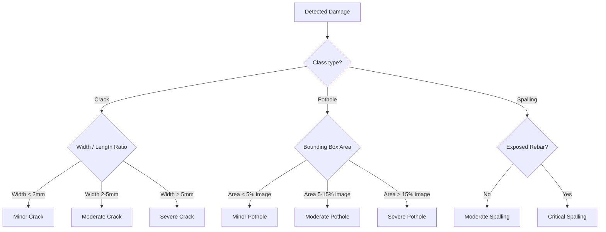

# Taxonomy & Class Mapping Contract

This document acts as the frozen contract for damage classes, mapping rules, and severity metrics for the `civiclens` machine learning model.

---

## 1. Damage Classes Taxonomy

We define **7 unified damage classes** covering both asphalt road distress and concrete bridge/structural defects.

| Class ID | Target Class Name | Source Equivalent | Description |
| :--- | :--- | :--- | :--- |
| **0** | `pothole` | RDD2022: `D40` Custom India: `pothole` | Bowl-shaped depressions in the road surface, including deep rutting and missing pavement chunks. |
| **1** | `longitudinal_crack` | RDD2022: `D00` Custom India: `longitudinal_crack` | Cracks running parallel to the direction of travel (often along joints or wheel paths). |
| **2** | `transverse_crack` | RDD2022: `D10` Custom India: `transverse_crack` | Cracks running perpendicular to the direction of travel (often thermal cracks). |
| **3** | `alligator_crack` | RDD2022: `D20` Custom India: `alligator_crack` | Interconnected cracks forming a network resembling alligator skin (fatigue cracking). |
| **4** | `concrete_crack` | SDNET2018: `crack` Bridge Crack: `crack` | Structural cracks in concrete decks, beams, abutments, or piers. |
| **5** | `spalling` | Bridge Crack: `spalling` | Chipping, scaling, or flaking of concrete, often exposing underlying reinforcement steel (rebar). |
| **6** | `corrosion` | (New Class) | Rust staining, scaling, or active oxidation on steel elements or rebar on bridges. |

---

## 2. Dataset Mapping Rules

The raw annotations from different datasets are unified into the target classes using the following translation logic:

### Road Damage Detection 2022 (RDD2022)
* `D00` $\rightarrow$ `longitudinal_crack`
* `D10` $\rightarrow$ `transverse_crack`
* `D20` $\rightarrow$ `alligator_crack`
* `D40` $\rightarrow$ `pothole`
* *Note: Class `D30` (Rutting) and others are ignored unless they fit the severity criteria of potholes.*

### Bridge Crack Dataset & Hugging Face (`CodeNova/bridge-crack-dataset`)
* `crack` $\rightarrow$ `concrete_crack`
* `spalling` $\rightarrow$ `spalling`

### Custom Indian Images
* `pothole` $\rightarrow$ `pothole`
* `longitudinal_crack` $\rightarrow$ `longitudinal_crack`
* `transverse_crack` $\rightarrow$ `transverse_crack`
* `alligator_crack` $\rightarrow$ `alligator_crack`

---

## 3. Severity Definitions

For automated damage assessment, the system uses bounding box properties and pixel dimensions to assign severity levels:

* **Minor**: Hairline cracks, shallow depressions. No immediate action required.
* **Moderate**: Clear separation, medium potholes. Monitor and schedule routine maintenance.
* **Severe**: Wide cracks (>5mm), deep potholes, exposed rebar. Immediate hazard; requires urgent intervention.
